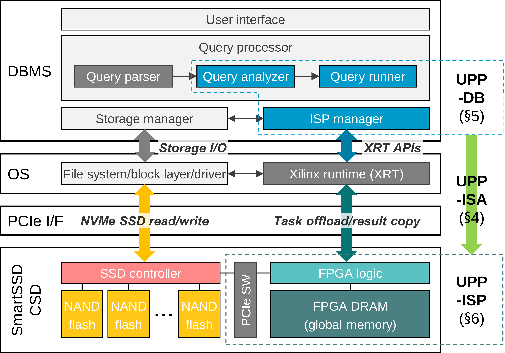

# Artifact Evaluation for "UPP: Universal Predicate Pushdown to Smart Storage", ISCA 2025.

In this artifact, we provide guidelines for reproducing the key experimental results presented in the paper. The experiments detailed in §8 fall into three main categories:
• Performance and energy comparison: evaluating the performance (Fig. 6) and energy consumption (Fig. 7) of the baseline analytical database (CPU) versus the UPP-enabled
database (UPP). Filter ratio and CPU utilization are also presented in Fig. 6 and Fig. 7, respectively
• Impact of ISP capabilities: investigating how varying ISP capabilities influence the potential performance improvements of UPP (Fig. 8a)
• Impact of hash length: measuring the impact of different hash lengths on ISP processing performance (Fig. 8b)

<p align="center">
  
</p>

### Running experiments for Figure 6 and Figure 7
First, follow the instructions below to run the experiments. The output files will be saved in the ```output_results``` directory:

```bash
chmod +x run_upp_experiments.sh
```
Then run experiments. 

```bash
./run_upp_experiments.sh
```
This will run 22 TPC-H queries with baseline and UPP.

### Process results
Afterwards, use ```process_results.sh``` to process the output files into readable formats: ```figure6_data.txt```, ```figure7_data.txt```, ```figure8a_data.txt```, and ```figure8b_data.txt```.
```bash
bash process_results.sh
```
Before running the scripts to generate output files, make sure the following input files and directories are present: ```runningtime_baseline.txt```, ```runningtime_usps.txt```, ```filtered_ratio_log.txt```, ```output_results/ (directory)```, and ```fig8/ (directory)```.    
```process_results.py```: Generates `.txt` files containing results for **Figure 6** and **Figure 7**.  
```process_results_fig8.py```: Generates `.txt` files containing results for **Figure 8(a)** and **Figure 8(b)**.   
You can run the Python scripts individually using:   
```bash
python process_results.py
python process_results_fig8.py
```


### Generating Hash
Use `hash.py` to generate hash for data, query, and the percentiles used to generate the hash. 

Percentiles
```
python hash.py percentiles --input <input.tbl> --output <output_percentiles.npy> [--delimiter <delimiter>] [--size <hash_size>] [--chunksize <chunk_size>]
```
Data Hash
```
python hash.py data --input <input.tbl> --output-hash <output_hash.bin> [--output-len <output_len.bin>] [--percentile <percentile_file.npy>] [--delimiter <delimiter>] [--size <hash_size>]
```
Query Hash
```
python hash.py query --output-dir <output_directory> [--base-dir <percentile_base_dir>] [--size <hash_size>]
```
